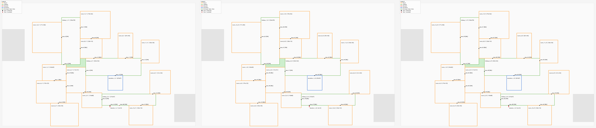

# Indoor Data Pipeline

Stateless conversion service that translates upstream floor-plan formats into the canonical `MapImportSchema` JSON the spatial backend consumes. Today it speaks DXF / DWG; future stages can add IFC, BIM exports, etc. behind the same `/api/*/parse` shape.

The pipeline has **no database connection**. It only parses bytes and returns JSON — the spatial backend takes that JSON and performs the Neo4j + PostGIS writes via its existing `ImportService`.

## Architecture

```
[mapmaker / iOS]
       |
       v
[middleware] -> [backend POST /campuses/import-dxf]
                       |
                       |  multipart upload (file + form metadata)
                       v
              [pipeline POST /api/dxf/parse]   <-- this service
              (ezdxf + shapely + classify)
                       |
                       |  {schema: MapImportSchema, summary: {...}}
                       v
        [backend ImportService -> Neo4j + PostGIS]
```

Why a separate service:

- the spatial backend stays small; the heavy CAD libs (`ezdxf`, `shapely`, LibreDWG native build) only live in this image.
- swappable: a different group can rewrite the parser in any language as long as it speaks the same `POST /api/dxf/parse` contract.
- adding new input formats (IFC, JSON dumps from other CAD tools) is a new route here, no changes to the backend image.

## Layout

```
aau-sw8-indoor-data-pipeline/
  main.py                # FastAPI app, mounts the DXF router
  routes_dxf.py          # POST /api/dxf/parse
  dxf/
    __init__.py
    helpers.py           # label classifier, polygon hygiene, DWG transcode
    normalize.py         # Stage 1: bytes -> normalized JSON
    convert.py           # Stage 2: normalized JSON -> MapImportSchema
  Dockerfile             # python:3.11-slim + LibreDWG + (optional) ODA
  requirements.txt       # fastapi, uvicorn, ezdxf, shapely, python-multipart
  app.cfg                # legacy config template (kept for reference)
  pathfinding/           # legacy IEEE-paper prototype (see "Legacy" below)
  routes_pathfinding.py  # legacy router (not mounted in main.py)
  ROUTES_INPUTS.md       # legacy route reference
  images/
```

## Endpoints

Base URL: `http://localhost:6969`

### `GET /health`

```json
{ "status": "ok" }
```

### `POST /api/dxf/parse`

`multipart/form-data` body:

| field                       | required | default        | notes                                              |
| --------------------------- | -------- | -------------- | -------------------------------------------------- |
| `file`                      | yes      |                | the `.dxf` (or `.dwg`) bytes                       |
| `campus_id`                 | yes      |                |                                                    |
| `campus_name`               | yes      |                |                                                    |
| `building_id`               | yes      |                |                                                    |
| `building_name`             | yes      |                |                                                    |
| `floor_id`                  | yes      |                |                                                    |
| `floor_index`               | no       | `0`            |                                                    |
| `floor_display_name`        | no       | `"Ground"`     |                                                    |
| `organization_id`           | no       |                |                                                    |
| `organization_name`         | no       |                |                                                    |
| `organization_entity_type`  | no       | `"UNIVERSITY"` |                                                    |
| `organization_description`  | no       |                |                                                    |
| `campus_description`        | no       |                |                                                    |
| `building_short_name`       | no       | first word of `building_name` |                                  |
| `origin_bearing`            | no       | `0.0`          | degrees                                            |
| `layer_mapping`             | no       |                | JSON object `{"LAYER_NAME": "SPACE_TYPE"}`         |

Response:

```json
{
  "schema": { "...MapImportSchema dict..." },
  "summary": {
    "rooms_detected": 42,
    "doors_inferred": 36,
    "arc_candidates_filtered": 51,
    "unit_scale_m": 0.001,
    "warnings": ["..."],
    "label_stats": { "rooms_with_contained_label": 38, "...": "..." },
    "classification_summary": { "ROOM_OFFICE": 12, "CORRIDOR": 4, "...": "..." }
  }
}
```

Errors:

- `415` — input was a `.dwg` and no transcoder (`dwgread` or `ODAFileConverter`) is on PATH in the container
- `422` — empty file, malformed `layer_mapping`, or DXF too damaged to recover
- `500` — anything else from the parse pipeline

## Run

### Docker (recommended)

The pipeline is typically run as part of the spatial-backend compose stack — see `aau-sw8-spatial-backend/docker-compose.yml` for the `indoor_data_pipeline` service entry.

### Standalone

```bash
docker build -t indoor-data-pipeline:latest .
docker run --rm -p 6969:6969 indoor-data-pipeline:latest
```

### Local Python

```bash
pip install -r requirements.txt
uvicorn main:app --host 0.0.0.0 --port 6969
```

### Smoke test

```bash
curl -X POST http://localhost:6969/api/dxf/parse \
  -F "file=@../ACM-stue.dxf" \
  -F "campus_id=campus-aau-cph" \
  -F "campus_name=AAU CPH" \
  -F "building_id=bldg-acm15" \
  -F "building_name=A.C. Meyers Vænge 15" \
  -F "floor_id=bldg-acm15-0" \
  -F "floor_index=0" \
  -F "floor_display_name=Stue"
```

## CLI scripts

The repo-root `scripts/` directory ships thin CLI wrappers around the same `dxf/` modules:

- `scripts/dxf_normalize.py file.dxf` — Stage 1 only, writes `file_normalized.json`
- `scripts/normalized_to_export.py file_normalized.json` — Stage 2 only
- `scripts/dxf_pipeline.py file.dxf` — both stages, writes `file_export.json`

They add this directory to `sys.path` so the imports resolve without needing the container.

## Legacy: IEEE-paper pathfinding prototype

This directory previously held a separate prototype that implemented the indoor topology + pathfinding pipeline described in [IEEE 10099457](https://ieeexplore.ieee.org/stamp/stamp.jsp?tp=&arnumber=10099457). Those files are preserved as-is for reference but **not** mounted in the current `main.py`:

- `routes_pathfinding.py`
- `pathfinding/` (service / repository / Dijkstra / SVG renderers / models)
- `ROUTES_INPUTS.md`

They depended on local `.config` and `.db` modules that were never checked into the repository, so they could not be started anyway. If someone wants to revive them, author those two modules and add `app.include_router(pathfinding_router)` back in `main.py`.


